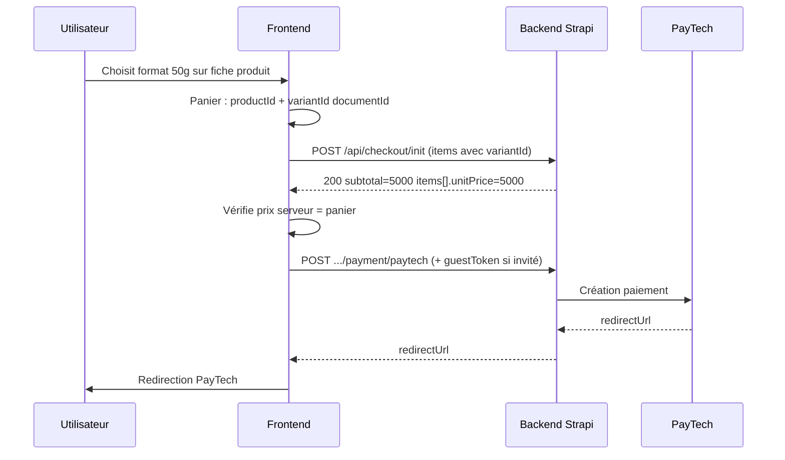

# Backend — Checkout : corrections à déployer (ticket complet)

**Audience :** équipe backend (`nyra-cms` / Strapi 5, Railway)  
**Émetteur :** équipe frontend — mai/juin 2026  
**API prod :** `https://secretdenyra-backend-production.up.railway.app`  
**Front prod :** `https://secretsdenyra.com` · `https://secretdenyra-frontend.vercel.app`

**Documents liés :**

| Fichier | Contenu |
|---------|---------|
| [`backend-correction-checkout-paytech.md`](./backend-correction-checkout-paytech.md) | PayTech 503, variables Railway |
| [`frontend-checkout-api.md`](../frontend-checkout-api.md) | Contrat routes, CORS, invité, confirm |
| [`frontend-checkout-variantes.md`](../frontend-checkout-variantes.md) | Détail `variantId` côté front |

---

## Résumé exécutif

| # | Problème | Impact utilisateur | État prod (dernier test) |
|---|----------|-------------------|---------------------------|
| **A** | `variantId` ignoré dans `checkout/init` | Paie le prix **250g** même en ayant choisi **50g** | **Non corrigé** |
| **B** | Catégorie **Secret de Nyra** absente du resolver checkout | Impossible de commander `product-1`, `product-4`, etc. | **Non corrigé** |
| **C** | PayTech **503** `PAYMENT_TIMEOUT` | Pas de redirection paiement après `init` OK | **Non corrigé** (compte PayTech) |
| **D** | **CORS** : domaine `secretsdenyra.com` | Erreurs navigateur si origin non whitelistée | À vérifier |

Le frontend envoie déjà les bons champs et **bloque PayTech** si le montant renvoyé par `init` ne correspond pas au panier. **Sans correctif backend, le checkout reste bloqué** pour les variantes et Secret de Nyra.

---

## Ce que le frontend envoie aujourd’hui

### `POST /api/checkout/init`

```http
POST /api/checkout/init
Content-Type: application/json
Authorization: Bearer {jwt}   # si connecté — pas de X-Checkout-Token sur init
```

Body (extrait) :

```json
{
  "customer": {
    "firstName": "…",
    "lastName": "…",
    "email": "…",
    "phone": "…"
  },
  "shippingAddress": { "line1": "…", "city": "…", "country": "SN", "line2": "", "postalCode": "", "region": "" },
  "billingAddress": { "…": "…" },
  "billingSameAsShipping": true,
  "items": [
    {
      "productId": "darjeeling-ftgfop1-chamong-bio-en-vrac",
      "variantId": "kt9xifoz7nw1xp16ejyqoabw",
      "quantity": 1
    }
  ]
}
```

### Règles `items[]` (contrat attendu)

| Champ | Obligatoire | Valeurs acceptées | Comportement attendu |
|-------|-------------|-------------------|----------------------|
| `productId` | Oui | `slug`, `documentId` Strapi, `id` numérique (string) | Résoudre le produit **publié** en prod |
| `variantId` | Si le produit a **≥ 2** variantes | `documentId` variante (priorité front), `id` numérique, `sku` | Prix = **cette** variante |
| `variantId` | Non | Produit **0 variante** (Secret de Nyra) | Ignorer `variantId`, prix = `product.price` |
| `quantity` | Oui | entier ≥ 1 | — |

**Priorité front :** `productId` = `product.documentId ?? product.slug` · `variantId` = `variant.documentId ?? variant.id`.

---

## Problème A — Variantes : `variantId` ignoré

### Symptôme

- Fiche produit : l’utilisateur choisit **50g** (ex. 5 000 XOF).
- `POST /api/checkout/init` renvoie quand même **24 800 XOF** et `variant.label = "250g"`.

### Tests API prod (reproductibles)

Produit : **`darjeeling-ftgfop1-chamong-bio-en-vrac`**

Variantes **réelles en prod** (catalogue Strapi, mai 2026) :

| Format | `id` numérique | `documentId` |
|--------|----------------|--------------|
| 250g | `2238` | `lp7ox6w1w171vzrpig742s7x` |
| 50g | `2240` | `kt9xifoz7nw1xp16ejyqoabw` |

| Requête `items` | `subtotal` attendu | **Résultat actuel prod** |
|-----------------|-------------------|---------------------------|
| sans `variantId` | 24 800 (défaut 250g) | 24 800 ✓ |
| `variantId: "kt9xifoz7nw1xp16ejyqoabw"` (50g doc) | **5 000** | **24 800** + label **250g** ✗ |
| `variantId: "lp7ox6w1w171vzrpig742s7x"` (250g doc) | 24 800 | 24 800 (OK par hasard) ✗ label |
| `variantId: "2240"` (50g num) | **5 000** | **24 800** ✗ |

### Cause probable

Dans le resolver checkout (`resolveCheckoutLineItem` ou équivalent) :

- `variantId` n’est pas lu, ou
- seule la variante par défaut / première position est utilisée pour le prix.

### Correctif attendu

1. Résoudre `items[].variantId` par **documentId**, puis **id** numérique, puis **sku**.
2. Si plusieurs variantes et `variantId` absent → variante `isDefault` ou première.
3. Si `variantId` invalide pour ce produit → **400** `VARIANT_NOT_FOUND` (pas 404 produit).
4. Recalculer `items[].unitPrice`, `lineTotal`, `subtotal`, `shipping`, `total`.
5. Renseigner `items[].variant` avec la **bonne** variante (label, format, price).

### Réponse `init` attendue (exemple 50g)

```json
{
  "checkoutId": "chk_…",
  "guestToken": "gst_…",
  "subtotal": 5000,
  "shipping": 2500,
  "total": 7500,
  "currency": "XOF",
  "items": [
    {
      "quantity": 1,
      "unitPrice": 5000,
      "lineTotal": 5000,
      "product": { "slug": "darjeeling-ftgfop1-chamong-bio-en-vrac", "name": "…" },
      "variant": { "label": "50g", "format": "50g", "price": 5000 }
    }
  ]
}
```

### Script de test (PowerShell)

```powershell
$uri = 'https://secretdenyra-backend-production.up.railway.app/api/checkout/init'
$body = @{
  customer = @{ firstName='Test'; lastName='API'; email='test@example.com'; phone='770000000' }
  shippingAddress = @{ line1='1 rue test'; line2=''; city='Dakar'; region=''; postalCode=''; country='SN' }
  billingAddress = @{ line1='1 rue test'; line2=''; city='Dakar'; region=''; postalCode=''; country='SN' }
  billingSameAsShipping = $true
  items = @(@{
    productId = 'darjeeling-ftgfop1-chamong-bio-en-vrac'
    variantId = 'kt9xifoz7nw1xp16ejyqoabw'
    quantity = 1
  })
} | ConvertTo-Json -Depth 6

$r = Invoke-RestMethod -Uri $uri -Method POST -ContentType 'application/json' -Body $body
# Attendu : $r.subtotal -eq 5000 et $r.items[0].variant.label -eq '50g'
```

### curl

```bash
curl -s -X POST "https://secretdenyra-backend-production.up.railway.app/api/checkout/init" \
  -H "Content-Type: application/json" \
  -d '{
    "customer":{"firstName":"Test","lastName":"API","email":"test@example.com","phone":"770000000"},
    "shippingAddress":{"line1":"1 rue test","city":"Dakar","country":"SN","line2":"","postalCode":"","region":""},
    "billingAddress":{"line1":"1 rue test","city":"Dakar","country":"SN","line2":"","postalCode":"","region":""},
    "billingSameAsShipping":true,
    "items":[{"productId":"darjeeling-ftgfop1-chamong-bio-en-vrac","variantId":"kt9xifoz7nw1xp16ejyqoabw","quantity":1}]
  }'
```

---

## Problème B — Secret de Nyra : `PRODUCT_NOT_FOUND`

### Symptôme

Produits visibles dans le catalogue (`GET /api/products`) mais :

```http
POST /api/checkout/init
→ 404 { "code": "PRODUCT_NOT_FOUND", "message": "Produit ou variante introuvable." }
```

### Produits concernés (exemples)

| slug | documentId (doc / ancien réf.) | Variantes en base |
|------|--------------------------------|-------------------|
| `product-1` | `lxthm4wu4p6b8u3xcha8kc1y` | 0 |
| `product-3` | `ab1pht0swdub215ae83f9h8e` | 0 |
| `product-4` | `l3qls37jbu1tdojs3z1jba43` | 0 |

Catégorie : **`secret-de-nyra`**.

### Contrôle positif

| slug | Résultat |
|------|----------|
| `mauve-bio-en-vrac-250g` (herboristerie) | **200** |

### Cause probable

Le resolver checkout **exclut** la catégorie `secret-de-nyra` (filtre, whitelist, ou populate incomplet). Ce n’est **pas** un bug panier front.

### Correctif attendu

1. Inclure `secret-de-nyra` dans la même logique que `thes-bio`, `tisanes`, `herboristerie`.
2. Produits **sans variante** : prix = `product.price`, pas de `variantId` requis.
3. Accepter `productId` = slug **ou** documentId.

### Body minimal

```json
{
  "items": [{ "productId": "product-4", "quantity": 1 }]
}
```

### Test

```bash
curl -s -X POST "https://secretdenyra-backend-production.up.railway.app/api/checkout/init" \
  -H "Content-Type: application/json" \
  -d '{"customer":{"firstName":"T","lastName":"T","email":"t@test.com","phone":"770000000"},"shippingAddress":{"line1":"x","city":"Dakar","country":"SN"},"billingAddress":{"line1":"x","city":"Dakar","country":"SN"},"billingSameAsShipping":true,"items":[{"productId":"product-4","quantity":1}]}'
```

**Attendu : HTTP 200** + `checkoutId` + `guestToken`.

---

## Problème C — PayTech 503 (après `init` OK)

Voir le document dédié : [`backend-correction-checkout-paytech.md`](./backend-correction-checkout-paytech.md).

En bref :

```http
POST /api/checkout/{checkoutId}/payment/paytech
→ 503 { "code": "PAYMENT_TIMEOUT", … }
```

**Action :** activer le compte PayTech en production + variables `PAYTECH_*` sur **Railway** (jamais sur le front).

---

## Problème D — CORS

### Symptôme front

Navigateur bloque les requêtes : *No 'Access-Control-Allow-Origin'*.

### Origines à autoriser

| Origin | Usage |
|--------|--------|
| `http://localhost:5173` | Dev Vite |
| `http://127.0.0.1:5173` | Dev Vite |
| `https://secretdenyra-frontend.vercel.app` | Preview Vercel |
| `https://secretsdenyra.com` | **Prod domaine principal** |
| `https://www.secretsdenyra.com` | Prod avec www |

Fichier typique : `config/middlewares.ts` (Strapi).

Headers à exposer pour le checkout invité :

- `Authorization`
- `X-Checkout-Token` (routes **après** `init` : paytech, confirm, etc.)

---

## Codes d’erreur — à respecter

| HTTP | `code` | Quand |
|------|--------|--------|
| 404 | `PRODUCT_NOT_FOUND` | Produit introuvable ou non publié |
| 400 | `VARIANT_NOT_FOUND` | Produit OK, **`variantId` invalide** |
| 409 | `OUT_OF_STOCK` | Stock insuffisant pour le format |
| 410 | `CHECKOUT_EXPIRED` | Session expirée |
| 503 | `PAYMENT_TIMEOUT` | PayTech indisponible / compte non activé |

**Ne pas** renvoyer `PRODUCT_NOT_FOUND` quand seul le format est faux → utiliser `VARIANT_NOT_FOUND`.

Format JSON :

```json
{
  "code": "VARIANT_NOT_FOUND",
  "message": "…",
  "requestId": "…"
}
```

---

## Flux complet (rappel)



---

## Checklist déploiement backend

### Code

- [ ] Implémenter / merger `resolveCheckoutLineItem` (variantes + Secret de Nyra)
- [ ] `VARIANT_NOT_FOUND` en 400 si mauvais `variantId`
- [ ] CORS : `secretsdenyra.com` + `www`

### Railway

- [ ] Redéployer le service backend après merge
- [ ] Vérifier variables PayTech (`PAYTECH_API_KEY`, `PAYTECH_API_SECRET`, environnement prod)

### Tests manuels post-déploiement

- [ ] Darjeeling + `variantId` 50g (`kt9xifoz7nw1xp16ejyqoabw`) → `subtotal` = **5000**
- [ ] Darjeeling + `variantId` 250g (`lp7ox6w1w171vzrpig742s7x`) → `subtotal` = **24800**
- [ ] `product-4` sans `variantId` → **200**
- [ ] `mauve-bio-en-vrac-250g` → **200** (régression)
- [ ] `init` puis `payment/paytech` → **200** + `redirectUrl` (si PayTech activé)

### Communication front

Quand les 4 tests ci-dessus passent, prévenir l’équipe front : le garde-fou « prix serveur ≠ panier » laissera passer PayTech normalement.

---

## Ce que le front a déjà fait (ne pas redemander)

- Envoi systématique de `variantId` (documentId Strapi) au `init`
- `productId` = `documentId ?? slug`
- Suppression du blocage UI sur `secret-de-nyra` (en attente backend)
- Validation après `init` : si `unitPrice` / `subtotal` ≠ panier → **pas de redirection PayTech** + message utilisateur
- Messages UI pour `PRODUCT_NOT_FOUND`, `VARIANT_NOT_FOUND`, PayTech, etc.

Le front **ne peut pas** corriger le montant PayTech si `init` renvoie un mauvais total.

---

## Références techniques suggérées (backend)

- Handler : `POST /api/checkout/init`
- Fonction cible : résolution ligne panier (`resolveCheckoutLineItem` ou nom équivalent dans `nyra-cms`)
- Populate Strapi : produit + `variants` ; matcher `variantId` sur `documentId`, `id`, `sku`
- Catégories : ne pas filtrer `secret-de-nyra` pour le checkout

---

*Dernière vérification API prod : juin 2026 — variantes et Secret de Nyra encore en échec ; transmettre ce document tel quel à l’équipe backend.*
