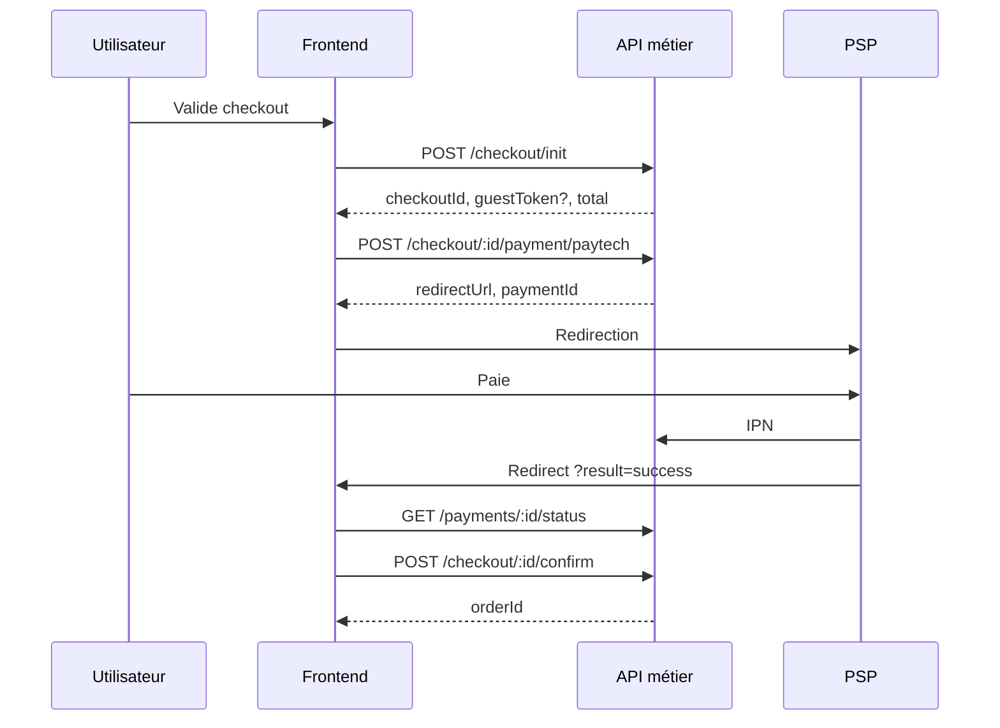

# Cahier des charges — API de paiement e-commerce (modèle Checkout + PSP)

**Version :** 1.0 — mai 2026  
**Objectif :** spécifier une API backend permettant à un frontend (web / mobile) d’encaisser des commandes via un **prestataire de paiement externe** (PSP), sans exposer les secrets au client.  
**Référence d’implémentation :** flux Nyra (Strapi + PayTech) — adaptable à Stripe, PayTech, etc.

---

## 1. Contexte et périmètre

### 1.1 Problème à résoudre

Le site e-commerce doit :

1. Créer une **session de commande** (checkout) avec prix recalculés côté serveur.
2. Rediriger l’acheteur vers une **page de paiement hébergée par le PSP** (Wave, Orange Money, carte, etc.).
3. Être notifié du résultat (**webhook / IPN**) et **créer la commande** uniquement après paiement réussi.
4. Supporter **invité** (sans compte) et **utilisateur connecté** (JWT).

### 1.2 Hors périmètre (v1)

- Choix du moyen de paiement côté boutique (Wave vs OM vs carte) — fait sur la page PSP.
- Paiement en plusieurs fois, abonnements, remboursements partiels (v2).
- Appels directs du navigateur vers l’API du PSP.

### 1.3 Acteurs

| Acteur | Rôle |
|--------|------|
| **Client** (navigateur / app) | Panier, formulaire livraison, redirection paiement |
| **API métier** (votre backend) | Checkout, commandes, auth, catalogue |
| **PSP** (ex. PayTech) | Encaissement, page de paiement, notifications |

### 1.4 Architecture cible

```text
[Frontend]  ──HTTPS──►  [API métier /api/...]  ──HTTPS──►  [PSP]
                              ▲
                              │ IPN / webhook (serveur à serveur)
                              │
                         [PSP notifie le backend]
```

**Règle d’or :** le frontend ne connaît que l’URL de **votre** API. Les clés PSP restent sur le serveur.

---

## 2. Objectifs fonctionnels

| ID | Objectif | Priorité |
|----|----------|----------|
| F1 | Créer une session checkout avec total fiable (prix, stock, livraison) | P0 |
| F2 | Initier un paiement et renvoyer une `redirectUrl` | P0 |
| F3 | Recevoir et traiter les notifications PSP (succès / annulation) | P0 |
| F4 | Finaliser la commande (`confirm`) après paiement validé | P0 |
| F5 | Consulter le statut d’un paiement (polling secours) | P1 |
| F6 | Checkout invité avec jeton dédié | P0 |
| F7 | Checkout utilisateur connecté (JWT + panier serveur optionnel) | P0 |
| F8 | Lister les paiements en attente (compte client) | P2 |
| F9 | Idempotence : double `confirm` / double IPN sans double commande | P0 |

---

## 3. Modèle de données (conceptuel)

### 3.1 Entités

| Entité | Description | Identifiant |
|--------|-------------|-------------|
| **CheckoutSession** | Brouillon commande avant paiement | `chk_` + UUID |
| **Payment** | Tentative de paiement liée à un checkout | UUID |
| **Order** | Commande confirmée après succès | `documentId` ou UUID |
| **GuestToken** | Droit d’accès invité au checkout | `gst_` + secret opaque |

### 3.2 États — CheckoutSession

| État | Description |
|------|-------------|
| `draft` | Créé, non payé |
| `payment_pending` | Redirection PSP envoyée |
| `paid` | Paiement confirmé, commande créée |
| `expired` | TTL dépassé (~6 h recommandé) |
| `canceled` | Paiement annulé ou abandonné |

### 3.3 États — Payment

| État | Description |
|------|-------------|
| `PENDING` | En attente sur PSP |
| `SUCCESS` | Payé (IPN ou statut PSP) |
| `CANCELED` | Annulé par l’utilisateur ou PSP |
| `FAILED` | Refusé / erreur technique |

### 3.4 Données minimales persistées

**CheckoutSession**

- `checkoutId`, `status`, `expiresAt`
- `customer` (nom, email, téléphone)
- `shippingAddress`, `billingAddress`
- `items[]` : `productId`, `variantId?`, `quantity`, `unitPrice`, `lineTotal`
- `subtotal`, `shipping`, `discounts[]`, `total`, `currency` (ex. `XOF`)
- `userId?` (si JWT)
- `guestTokenHash?` (invité — ne jamais stocker le token en clair si possible)

**Payment**

- `paymentId`, `checkoutId`, `refCommand` (référence unique PSP)
- `pspToken?`, `redirectUrl` (optionnel après init)
- `status`, `amount`, `currency`
- `pspRawResponse?` (audit, JSON)
- `createdAt`, `updatedAt`

**Order**

- Lien `checkoutId`, `paymentId`, lignes, statut `paid`, adresses, etc.

---

## 4. Règles métier

### 4.1 Prix et stock

- **Recalcul obligatoire côté serveur** à `init` (ne pas faire confiance au total front).
- Refuser `init` si stock insuffisant → HTTP **409** `OUT_OF_STOCK`.
- Devise unique en v1 : **XOF** (extensible).

### 4.2 Livraison

- Exemple : gratuit si `subtotal >= 45 000 XOF`, sinon frais fixes `2 500 XOF` (paramétrable en config).

### 4.3 Identifiants produit

`productId` dans `items[]` doit accepter au moins :

- `documentId` CMS,
- `slug`,
- `id` numérique interne.

Produit **publié** sur l’environnement cible. Sinon → **404** `PRODUCT_NOT_FOUND`.

### 4.4 Invité vs connecté

| Cas | Auth `init` | `guestToken` | Panier |
|-----|-------------|--------------|--------|
| Invité | Aucune | Généré à `init`, requis ensuite | `items[]` obligatoire dans le body |
| Connecté | `Authorization: Bearer JWT` | Non renvoyé | `items[]` optionnel si panier serveur |

### 4.5 Sécurité invité

- Header : `X-Checkout-Token: {guestToken}` sur `payment`, `status`, `confirm`.
- **Ne pas** exiger ce header sur `init` (c’est `init` qui le crée).
- Token lié à un seul `checkoutId`, révocable à expiration.

### 4.6 Référence commande PSP

- Format recommandé : `NYRA-{timestamp}-{random}` (préfixe projet + unicité).
- Une référence = une tentative `Payment` ; nouvelle tentative = nouvelle référence.

---

## 5. API REST — Spécification

**Base :** `https://{API_HOST}/api`  
**Format :** JSON, UTF-8  
**Erreurs :** voir §7.

### 5.1 `POST /checkout/init`

Crée une session checkout.

**Auth :** publique ; JWT optionnel.

**Body**

```json
{
  "customer": {
    "firstName": "string",
    "lastName": "string",
    "email": "user@example.com",
    "phone": "+221771234567"
  },
  "shippingAddress": {
    "line1": "string",
    "line2": "",
    "city": "string",
    "region": "",
    "postalCode": "",
    "country": "SN"
  },
  "billingSameAsShipping": true,
  "billingAddress": { },
  "items": [
    { "productId": "string", "quantity": 1, "variantId": "string?" }
  ]
}
```

**Validation**

| Champ | Règle |
|-------|--------|
| `customer.firstName`, `lastName`, `phone` | Non vides |
| `customer.email` | Email valide |
| `shippingAddress.line1`, `city`, `country` | Obligatoires |
| `items` | Obligatoire si invité ; optionnel si JWT + panier serveur |

**Réponse 200**

```json
{
  "checkoutId": "chk_...",
  "checkout_session_id": "chk_...",
  "status": "draft",
  "expiresAt": "ISO-8601",
  "guestToken": "gst_...",
  "subtotal": 0,
  "shipping": 0,
  "total": 0,
  "currency": "XOF",
  "items": []
}
```

`guestToken` : présent **uniquement** sans JWT valide.

---

### 5.2 `POST /checkout/:checkoutId/payment/{provider}`

Exemple : `payment/paytech`. Initie le paiement chez le PSP.

**Auth :** JWT **ou** `X-Checkout-Token`.

**Body :** vide `{}` ou absent.

**Traitement serveur**

1. Vérifier checkout non expiré, statut `draft` ou `payment_pending`.
2. Vérifier stock encore OK.
3. Appeler PSP `request-payment` avec montant, `ref_command`, URLs de retour.
4. Créer / mettre à jour `Payment` en `PENDING`.
5. Retourner l’URL de redirection.

**Réponse 201**

```json
{
  "paymentId": "uuid",
  "refCommand": "NYRA-...",
  "token": "psp-token",
  "status": "PENDING",
  "redirectUrl": "https://psp.example/checkout/..."
}
```

**Action front :** `window.location.href = redirectUrl`.

---

### 5.3 `GET /payments/:paymentId/status`

**Auth :** JWT ou `X-Checkout-Token`.

**Réponse 200**

```json
{
  "paymentId": "uuid",
  "status": "PENDING",
  "refCommand": "NYRA-...",
  "errorType": null
}
```

**Usage :** polling côté page de retour (2–3 s, max 30–60 s) si l’IPN est lent.

---

### 5.4 `POST /checkout/:checkoutId/confirm`

Finalise la commande après paiement réussi.

**Auth :** JWT ou `X-Checkout-Token`.

**Body**

```json
{
  "paymentMethod": "paytech",
  "paymentId": "uuid-optionnel"
}
```

Si `paymentId` omis : utiliser le dernier paiement réussi ou `PENDING` du checkout.

**Réponse 200**

```json
{
  "orderId": "string",
  "order_id": "string",
  "checkout_session_id": "chk_...",
  "status": "paid"
}
```

**Idempotence :** second appel → même `orderId` si déjà créée.

**Préconditions :** paiement `SUCCESS` (IPN ou statut PSP vérifié).

---

### 5.5 `POST /webhooks/{provider}/ipn`

Exemple : `/webhooks/paytech/ipn`. Appel **serveur à serveur** par le PSP.

**Auth :** signature HMAC ou hash documenté par le PSP (pas de JWT).

**Traitement**

| Événement PSP | Action |
|---------------|--------|
| Paiement réussi | `Payment` → `SUCCESS`, préparer commande (ou marquer checkout prêt à `confirm`) |
| Paiement annulé | `Payment` → `CANCELED` |

**Réponse :** HTTP **200**, corps texte `IPN OK` (selon exigence PSP).

**Sécurité :** rejeter si signature invalide ; journaliser `requestId`.

---

### 5.6 `GET /me/payments/pending` (optionnel v1)

**Auth :** JWT obligatoire.

**Réponse 200**

```json
{
  "items": [
    {
      "paymentId": "uuid",
      "status": "PENDING",
      "refCommand": "NYRA-...",
      "checkoutId": "chk_...",
      "amount": 17500,
      "currency": "XOF",
      "createdAt": "ISO-8601"
    }
  ],
  "count": 1
}
```

---

## 6. Intégration PSP (ex. PayTech)

### 6.1 Variables d’environnement (serveur uniquement)

```env
PSP_API_KEY=
PSP_API_SECRET=
PSP_BASE_URL=https://paytech.sn/api
PSP_ENV=prod
PSP_IPN_URL=https://{API_HOST}/api/webhooks/paytech/ipn
PSP_SUCCESS_URL=https://{FRONT_HOST}/checkout/payment/return?result=success
PSP_CANCEL_URL=https://{FRONT_HOST}/checkout/payment/return?result=cancel
```

### 6.2 Appel « initier paiement »

- Méthode : `POST {PSP_BASE_URL}/payment/request-payment`
- Headers : `API_KEY`, `API_SECRET`
- Paramètres typiques : `item_name`, `item_price`, `ref_command`, `command_name`, `currency`, `env`, `ipn_url`, `success_url`, `cancel_url`, `custom_field` (JSON : `checkoutId`, `paymentId`)

### 6.3 Vérification IPN

- HMAC-SHA256 ou SHA256 selon documentation PSP.
- Ne jamais faire confiance aux paramètres de retour navigateur seuls.

---

## 7. Format des erreurs

Toutes les erreurs métier :

```json
{
  "code": "ERROR_CODE",
  "message": "Message lisible",
  "requestId": "uuid",
  "details": {}
}
```

### 7.1 Catalogue de codes (minimum)

| HTTP | `code` | Cas |
|------|--------|-----|
| 400 | `INVALID_CUSTOMER_INFO` | Client invalide |
| 400 | `INVALID_SHIPPING_ADDRESS` | Adresse livraison |
| 400 | `INVALID_BILLING_ADDRESS` | Adresse facturation |
| 400 | `CART_EMPTY` | Panier vide |
| 401 | `UNAUTHORIZED` | JWT / token invité manquant ou invalide |
| 402 | `PAYMENT_DECLINED` | Paiement refusé à `confirm` |
| 404 | `NOT_FOUND` | Route ou URL incorrecte |
| 404 | `PRODUCT_NOT_FOUND` | Produit inconnu |
| 404 | `CHECKOUT_NOT_FOUND` | `checkoutId` inconnu |
| 409 | `OUT_OF_STOCK` | Stock insuffisant |
| 409 | `PAYMENT_INFO_INCOMPLETE` | Paiement pas encore confirmé |
| 410 | `CHECKOUT_EXPIRED` | Session expirée |
| 503 | `PAYMENT_INFO_INCOMPLETE` | Config PSP absente |
| 503 | `PAYMENT_TIMEOUT` | PSP injoignable ou rejet ; inclure `details.paytechMessage` |

---

## 8. Frontend — Contrat minimal

### 8.1 Configuration

```env
VITE_API_URL=https://api.example.com
```

Pas de clé PSP côté front.

### 8.2 Flux utilisateur



### 8.3 Session navigateur (`sessionStorage`)

| Clé | Contenu |
|-----|---------|
| `checkoutId` | Après `init` |
| `guestToken` | Après `init` (invité) |
| `paymentId` | Après `payment` |

Page de retour : `/checkout/payment/return?result=success|cancel` — lire `result` en query ; ids en **sessionStorage**, pas dans l’URL PSP.

### 8.4 CORS

Autoriser : origines front (dev + prod), headers `Content-Type`, `Authorization`, `X-Checkout-Token`.

---

## 9. Exigences non fonctionnelles

| Thème | Exigence |
|-------|----------|
| **Sécurité** | HTTPS partout ; secrets PSP en vault / variables Railway ; rate limiting sur `init` et webhooks |
| **Performance** | `init` < 2 s ; appel PSP timeout 60 s avec message clair |
| **Disponibilité** | IPN retentable (PSP reposte) → traitement idempotent |
| **Traçabilité** | `requestId` par requête ; logs corrélation `checkoutId` / `paymentId` / `refCommand` |
| **Conformité** | RGPD : minimiser données dans `custom_field` PSP ; durée rétention logs définie |
| **Tests** | Environnement PSP `test` + clés test ; scénarios succès / annulation / timeout |

---

## 10. Plan de livraison suggéré

| Phase | Livrable | Critère |
|-------|----------|---------|
| **P0 — Fondations** | `POST /checkout/init`, modèle données, erreurs JSON | Init 200 avec total correct |
| **P0 — PSP** | `POST .../payment/{provider}`, config env | 201 + `redirectUrl` en test PSP |
| **P0 — IPN** | Webhook + mise à jour `Payment` | IPN test → `SUCCESS` en base |
| **P0 — Commande** | `POST .../confirm` idempotent | Commande créée une seule fois |
| **P1 — Front** | Page retour + polling `status` | Parcours bout en bout sandbox |
| **P1 — Prod** | Compte PSP prod activé, URLs prod | Paiement réel 1 XOF test |
| **P2** | `GET /me/payments/pending`, analytics | Bandeau compte client |

---

## 11. Critères d’acceptation globaux

- [ ] Aucune clé PSP dans le frontend ou le repo public.
- [ ] Invité peut payer sans compte (`guestToken`).
- [ ] Utilisateur connecté peut payer avec JWT.
- [ ] Total commande = recalcul serveur (test avec prix front falsifié → refus ou correction).
- [ ] Double IPN ne crée pas deux commandes.
- [ ] Erreurs avec `code` + `message` (+ `details` PSP si 503).
- [ ] Parcours E2E sandbox documenté (curl ou Postman collection).
- [ ] Runbook : activation compte PSP prod, checklist variables Railway.

---

## 12. Annexes

### 12.1 Collection de tests (extrait curl)

```bash
API="https://api.example.com"
# init → extraire checkoutId, guestToken
# paytech → extraire redirectUrl
# (utilisateur paie sur PSP)
# status → SUCCESS
# confirm → orderId
```

### 12.2 Mapping fournisseur

| Concept métier | PayTech | Stripe (équivalent) |
|----------------|---------|---------------------|
| Init paiement | `request-payment` | `Checkout Session` |
| Notification | IPN `sale_complete` | `checkout.session.completed` |
| Redirection | `redirect_url` | `url` session |

### 12.3 Documents liés (projet Nyra)

| Fichier | Usage |
|---------|--------|
| `frontend-checkout-api.md` | Contrat détaillé front ↔ API |
| `docs/paytech-api-backend.md` | Détails PSP PayTech |
| `docs/backend-correction-checkout-paytech.md` | Retour d’expérience prod |

---

## 13. Glossaire

| Terme | Définition |
|-------|------------|
| **PSP** | Payment Service Provider (PayTech, Stripe, etc.) |
| **Checkout** | Session temporaire avant paiement |
| **IPN** | Instant Payment Notification — webhook PSP |
| **JWT** | Token utilisateur connecté |
| **guestToken** | Token opaque invité pour un checkout donné |

---

*Ce cahier des charges peut servir de base pour une nouvelle API (Node/Strapi/Nest, etc.) ou pour auditer une implémentation existante. Adapter les montants, TTL et noms de provider (`paytech` → autre) selon le projet.*
