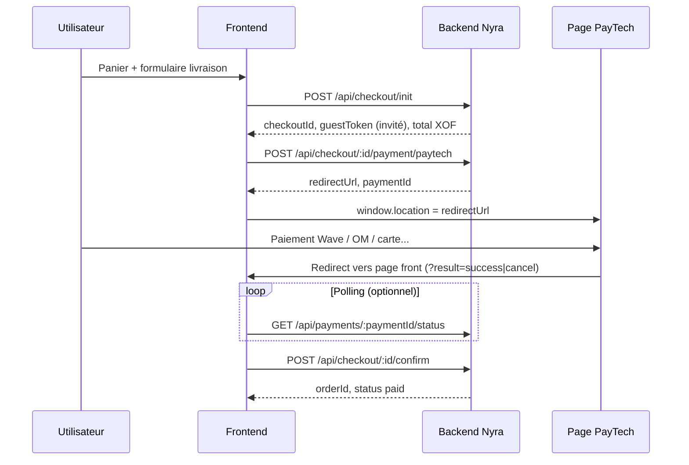

# Nyra — Guide d'intégration frontend (checkout & PayTech)

Document à transmettre à l'équipe **frontend** (Vite / Vercel).  
Le front **ne communique jamais directement avec PayTech** : uniquement l'API Strapi Nyra.

**Backend prod :** `https://secretdenyra-backend-production.up.railway.app`  
**Frontend prod :** `https://secretdenyra-frontend.vercel.app`

---

## Table des matières

1. [Configuration](#1-configuration)
2. [CORS et headers](#2-cors-et-headers)
3. [Flux global](#3-flux-global)
4. [État côté client (sessionStorage)](#4-état-côté-client-sessionstorage)
5. [API — Détail des routes](#5-api--détail-des-routes)
6. [Page de retour PayTech](#6-page-de-retour-paytech)
7. [Format des erreurs](#7-format-des-erreurs)
8. [Dépannage](#8-dépannage)
9. [Exemple client TypeScript](#9-exemple-client-typescript)
10. [Checklist d'intégration](#10-checklist-dintégration)

---

## 1. Configuration

### Variable d'environnement front

```env
VITE_API_URL=https://secretdenyra-backend-production.up.railway.app
```

En local :

```env
VITE_API_URL=http://localhost:1337
```

### Préfixe des routes

Toutes les routes documentées ci-dessous sont préfixées par **`/api`**.

Exemple complet :

```text
POST https://secretdenyra-backend-production.up.railway.app/api/checkout/init
```

### Ce que le front ne doit **jamais** faire

- Appeler `https://paytech.sn/api/...` depuis le navigateur
- Stocker ou exposer `PAYTECH_API_KEY`, `PAYTECH_API_SECRET`
- Utiliser des URLs **backend** pour les retours utilisateur après paiement (voir §6)

---

## 2. CORS et headers

### Origines autorisées (backend)

| Environnement | Origin |
|---------------|--------|
| Local Vite | `http://localhost:5173`, `http://127.0.0.1:5173` |
| Prod Vercel | `https://secretdenyra-frontend.vercel.app` |

Pour ajouter un nouveau domaine front → demander une mise à jour de `nyra-cms/config/middlewares.ts` côté backend.

### Headers autorisés (preflight CORS)

| Header | Usage |
|--------|--------|
| `Content-Type` | `application/json` |
| `Authorization` | `Bearer {jwt}` (utilisateur connecté) |
| `X-Checkout-Token` | Jeton invité (`guestToken`) |
| `Origin`, `Accept` | Standard |

### Règle importante : quand envoyer `X-Checkout-Token`

| Route | JWT | `X-Checkout-Token` |
|-------|-----|-------------------|
| `POST /api/checkout/init` | Optionnel | **Non requis** (c'est cette route qui **renvoie** le token) |
| `POST .../payment/paytech` | Ou invité | **Oui** si invité |
| `GET /api/payments/:id/status` | Ou invité | **Oui** si invité |
| `POST .../confirm` | Ou invité | **Oui** si invité |
| `GET /api/me/payments/pending` | **Obligatoire** | Non |

Ne pas attacher `X-Checkout-Token` sur **toutes** les requêtes via un intercepteur global si cela provoque des erreurs CORS sur `init` avant déploiement backend — après déploiement CORS à jour, le header est autorisé partout.

---

## 3. Flux global



**Moyen de paiement :** aucun choix Wave/Orange Money/carte côté Nyra — tout se fait sur la **page PayTech**.

**Devise :** `XOF` uniquement.

---

## 4. État côté client (sessionStorage)

Après `init`, persister (ex. `sessionStorage`) :

```ts
type CheckoutSession = {
  checkoutId: string;       // ex. chk_73d79bc714904d67...
  guestToken?: string;      // ex. gst_... — obligatoire si pas de JWT
  paymentId?: string;       // après payment/paytech
  refCommand?: string;
};
```

| Clé | Quand la remplir |
|-----|------------------|
| `checkoutId` | Réponse `init` |
| `guestToken` | Réponse `init` (invité uniquement) |
| `paymentId` | Réponse `payment/paytech` |

TTL checkout côté backend : **~6 heures**.

Après commande confirmée : vider ce stockage.

---

## 5. API — Détail des routes

### 5.1 `POST /api/checkout/init`

Crée une session checkout (invité ou connecté).  
**Auth :** aucune (route publique). JWT optionnel.

#### Body

```json
{
  "customer": {
    "firstName": "Awa",
    "lastName": "Diagne",
    "email": "awa@example.com",
    "phone": "+221771234567"
  },
  "shippingAddress": {
    "line1": "12 rue Example",
    "line2": "",
    "city": "Dakar",
    "postalCode": "12500",
    "country": "SN"
  },
  "billingSameAsShipping": true,
  "billingAddress": {
    "line1": "...",
    "city": "...",
    "country": "SN"
  },
  "items": [
    { "productId": "documentId-ou-slug-ou-id", "quantity": 2 }
  ]
}
```

#### Validation backend

| Champ | Règle |
|-------|--------|
| `customer.firstName`, `lastName`, `phone` | Non vides |
| `customer.email` | Format email valide |
| `shippingAddress` | `line1`, `city`, `country` obligatoires |
| `items` | **Obligatoire pour invité** ; optionnel si JWT (panier serveur) |

`productId` accepte : **`documentId`**, **`slug`**, ou **`id` numérique** du produit en base **prod**. La variante par défaut du produit est choisie automatiquement.

> Les IDs produits du panier en local doivent exister et être **publiés** sur le Strapi de production.

#### Réponse `200`

```json
{
  "checkoutId": "chk_...",
  "checkout_session_id": "chk_...",
  "status": "draft",
  "expiresAt": "2026-05-26T18:00:00.000Z",
  "guestToken": "gst_...",
  "subtotal": 15000,
  "shipping": 2500,
  "total": 17500,
  "currency": "XOF",
  "items": [],
  "analytics": {
    "checkout_session_id": "chk_...",
    "currency": "XOF",
    "value": 17500,
    "items": []
  }
}
```

- `guestToken` : présent **uniquement** si pas de JWT valide.
- Frais de port : gratuit si `subtotal >= 45000` XOF, sinon `2500` XOF.

#### Erreurs

| HTTP | `code` |
|------|--------|
| 400 | `INVALID_CUSTOMER_INFO`, `INVALID_SHIPPING_ADDRESS`, `INVALID_BILLING_ADDRESS`, `CART_EMPTY` |
| 404 | `PRODUCT_NOT_FOUND` |
| 409 | `OUT_OF_STOCK` |

---

### 5.2 `POST /api/checkout/:checkoutId/payment/paytech`

Lance le paiement PayTech. Body : vide `{}` ou absent.

**Headers :** `Authorization: Bearer {jwt}` **ou** `X-Checkout-Token: {guestToken}`

#### Réponse `201`

```json
{
  "paymentId": "550e8400-e29b-41d4-a716-446655440000",
  "refCommand": "NYRA-1716729600000-ABC12345",
  "token": "paytech-token",
  "status": "PENDING",
  "redirectUrl": "https://paytech.sn/payment/checkout/..."
}
```

**Action UI :**

```ts
sessionStorage.setItem('paymentId', data.paymentId);
window.location.href = data.redirectUrl;
```

#### Erreurs

| HTTP | `code` | Cause probable |
|------|--------|----------------|
| 401 | `UNAUTHORIZED` | Invité sans `X-Checkout-Token` ou token invalide |
| 404 | `CHECKOUT_NOT_FOUND` | `checkoutId` inconnu |
| 410 | `CHECKOUT_EXPIRED` | Session expirée → refaire `init` |
| 400 | `CART_EMPTY` | Panier vide |
| 409 | `OUT_OF_STOCK` | Stock insuffisant |
| 503 | `PAYMENT_INFO_INCOMPLETE` | Clés PayTech absentes sur Railway |
| 503 | `PAYMENT_TIMEOUT` | PayTech a refusé — lire `details.paytechMessage` |

Exemple réponse 503 détaillée :

```json
{
  "code": "PAYMENT_TIMEOUT",
  "message": "Paiement temporairement indisponible.",
  "details": {
    "paytechReason": "paytech_rejected",
    "paytechMessage": "Le vendeur n'existe pas ou cle api invalide"
  },
  "requestId": "..."
}
```

---

### 5.3 `GET /api/payments/:paymentId/status`

**Headers :** JWT **ou** `X-Checkout-Token`

#### Réponse `200`

```json
{
  "paymentId": "uuid",
  "status": "PENDING",
  "refCommand": "NYRA-...",
  "errorType": null
}
```

Valeurs `status` : `PENDING` | `SUCCESS` | `CANCELED` | `FAILED`

**Polling suggéré** (page de retour) : toutes les **2–3 s**, max **30–60 s**, arrêt si `SUCCESS`, `CANCELED` ou `FAILED`.

---

### 5.4 `POST /api/checkout/:checkoutId/confirm`

Finalise la commande après paiement réussi.

**Headers :** JWT **ou** `X-Checkout-Token`

#### Body (PayTech)

```json
{
  "paymentMethod": "paytech",
  "paymentId": "uuid-optionnel"
}
```

Si `paymentId` est omis, le backend utilise le dernier paiement PayTech du checkout.

#### Réponse `200`

```json
{
  "orderId": "documentId-commande",
  "order_id": "documentId-commande",
  "checkout_session_id": "chk_...",
  "status": "paid",
  "analytics": {}
}
```

Idempotent : un second appel renvoie la même commande si déjà créée.

#### Erreurs

| HTTP | `code` |
|------|--------|
| 402 | `PAYMENT_DECLINED` |
| 409 | `PAYMENT_INFO_INCOMPLETE` (paiement pas encore confirmé) |
| 410 | `CHECKOUT_EXPIRED` |

---

### 5.5 `GET /api/me/payments/pending`

Paiements PayTech en attente pour le bandeau compte client.

**Auth :** JWT obligatoire.

#### Réponse `200`

```json
{
  "items": [
    {
      "paymentId": "uuid",
      "status": "PENDING",
      "refCommand": "NYRA-...",
      "checkoutId": "chk_...",
      "amount": 17500,
      "currency": "XOF",
      "createdAt": "2026-05-26T12:00:00.000Z"
    }
  ],
  "count": 1
}
```

---

### 5.6 Routes checkout **non utilisées** pour PayTech invité

Ces routes exigent un **JWT** (checkout lié au compte) :

| Route | Usage |
|-------|--------|
| `PATCH /api/checkout/:checkoutId` | Mise à jour brouillon |
| `GET /api/checkout/:checkoutId` | Lecture brouillon |
| `POST /api/checkout/:checkoutId/payment-intent` | **Stripe** (pas PayTech) |

Pour **invité + PayTech** : `init` → `payment/paytech` → page retour → `status` → `confirm` uniquement.

---

## 6. Page de retour PayTech

### URLs de redirection (configurées côté **backend**, mais pointent vers le **front**)

| Variable backend | URL prod (exemple) |
|------------------|-------------------|
| `PAYTECH_SUCCESS_URL` | `https://secretdenyra-frontend.vercel.app/checkout/payment/return?result=success` |
| `PAYTECH_CANCEL_URL` | `https://secretdenyra-frontend.vercel.app/checkout/payment/return?result=cancel` |
| `PAYTECH_IPN_URL` | `https://secretdenyra-backend-production.up.railway.app/api/webhooks/paytech/ipn` (**backend uniquement**, invisible pour l'utilisateur) |

Le front doit implémenter la route :

```text
/checkout/payment/return
```

### Comportement de la page de retour

1. Lire `checkoutId`, `paymentId`, `guestToken` depuis **sessionStorage** (pas depuis l'URL PayTech).
2. Lire `?result=success` ou `?result=cancel` pour l'UI.
3. Si `result=cancel` → message annulation, pas de `confirm`.
4. Si `result=success` :
   - Poller `GET /api/payments/:paymentId/status` jusqu'à `SUCCESS` (ou timeout),
   - Puis `POST /api/checkout/:checkoutId/confirm` avec `{ "paymentMethod": "paytech", "paymentId": "..." }`,
   - Rediriger vers page merci avec `orderId`,
   - Vider sessionStorage checkout.

> L'IPN backend confirme aussi le paiement en arrière-plan ; `confirm` côté front reste utile pour afficher la commande immédiatement.

---

## 7. Format des erreurs

Toutes les erreurs métier Nyra suivent ce format :

```json
{
  "code": "PRODUCT_NOT_FOUND",
  "message": "Produit ou variante introuvable.",
  "requestId": "uuid",
  "details": {}
}
```

### Ne pas confondre les 404

| `code` | Signification |
|--------|----------------|
| `NOT_FOUND` | **Route ou URL incorrecte** (`/api/checkouts/init`, URL sans `/api`, etc.) |
| `PRODUCT_NOT_FOUND` | Route OK, **produit introuvable** en prod (mauvais `productId` ou non publié) |
| `CHECKOUT_NOT_FOUND` | `checkoutId` invalide |

Toujours lire le **`code`** dans le body JSON, pas seulement le statut HTTP.

---

## 8. Dépannage

### CORS : `x-checkout-token is not allowed`

→ Backend pas à jour. Vérifier que `config/middlewares.ts` inclut `X-Checkout-Token` dans `headers` et redéployer Railway.

### `POST /api/checkout/init` → 404

1. Ouvrir l'onglet Network → **Response** → lire `code`.
2. Si `NOT_FOUND` : vérifier URL exacte et `VITE_API_URL`.
3. Si `PRODUCT_NOT_FOUND` : aligner les `productId` du panier avec le catalogue **prod** Strapi.

### `payment/paytech` → 503

| `code` | Action |
|--------|--------|
| `PAYMENT_INFO_INCOMPLETE` | Variables `PAYTECH_*` manquantes sur Railway (le `.env` local ne suffit pas) |
| `PAYMENT_TIMEOUT` | Lire `details.paytechMessage` ; vérifier clés PayTech et `PAYTECH_ENV` (`test` vs `prod`) |

### Erreurs d'URL fréquentes

| Incorrect | Correct |
|-----------|---------|
| `/api/checkouts/init` | `/api/checkout/init` |
| `/checkout/init` | `/api/checkout/init` |
| Appel direct à `paytech.sn` | Toujours passer par le backend Nyra |

---

## 9. Exemple client TypeScript

```ts
const API = import.meta.env.VITE_API_URL;

type CheckoutSession = {
  checkoutId: string;
  guestToken?: string;
  paymentId?: string;
};

function checkoutHeaders(session: CheckoutSession, jwt?: string | null) {
  const headers: Record<string, string> = {
    'Content-Type': 'application/json',
  };
  if (jwt) headers['Authorization'] = `Bearer ${jwt}`;
  else if (session.guestToken) headers['X-Checkout-Token'] = session.guestToken;
  return headers;
}

export async function initCheckout(
  body: Record<string, unknown>,
  jwt?: string,
): Promise<CheckoutSession & Record<string, unknown>> {
  const res = await fetch(`${API}/api/checkout/init`, {
    method: 'POST',
    headers: {
      'Content-Type': 'application/json',
      ...(jwt ? { Authorization: `Bearer ${jwt}` } : {}),
    },
    body: JSON.stringify(body),
  });
  const data = await res.json();
  if (!res.ok) throw data;
  return data;
}

export async function startPaytechPayment(
  session: CheckoutSession,
  jwt?: string | null,
) {
  const res = await fetch(
    `${API}/api/checkout/${session.checkoutId}/payment/paytech`,
    {
      method: 'POST',
      headers: checkoutHeaders(session, jwt),
    },
  );
  const data = await res.json();
  if (!res.ok) throw data;
  return data as { paymentId: string; redirectUrl: string };
}

export async function getPaymentStatus(
  paymentId: string,
  session: CheckoutSession,
  jwt?: string | null,
) {
  const res = await fetch(`${API}/api/payments/${paymentId}/status`, {
    headers: checkoutHeaders(session, jwt),
  });
  const data = await res.json();
  if (!res.ok) throw data;
  return data as { status: string };
}

export async function confirmCheckout(
  session: CheckoutSession,
  jwt?: string | null,
) {
  const res = await fetch(
    `${API}/api/checkout/${session.checkoutId}/confirm`,
    {
      method: 'POST',
      headers: checkoutHeaders(session, jwt),
      body: JSON.stringify({
        paymentMethod: 'paytech',
        paymentId: session.paymentId,
      }),
    },
  );
  const data = await res.json();
  if (!res.ok) throw data;
  return data as { orderId: string; status: string };
}
```

---

## 10. Checklist d'intégration

- [ ] `VITE_API_URL` = backend Railway en prod
- [ ] Route front `/checkout/payment/return` implémentée
- [ ] `sessionStorage` : `checkoutId`, `guestToken`, `paymentId`
- [ ] `X-Checkout-Token` sur paytech / status / confirm (pas obligatoire sur `init`)
- [ ] `productId` du panier = IDs/slugs **publiés en prod**
- [ ] Redirection `window.location.href = redirectUrl` après paytech
- [ ] Polling + `confirm` sur retour `?result=success`
- [ ] Gestion des `code` d'erreur dans l'UI
- [ ] Aucune clé PayTech dans le code front

---

## Référence backend

Spécification PayTech côté serveur : [`paytech-api-backend.md`](./paytech-api-backend.md) (équipe backend).

*Dernière mise à jour : mai 2026 — backend `nyra-cms` (Strapi 5).*
