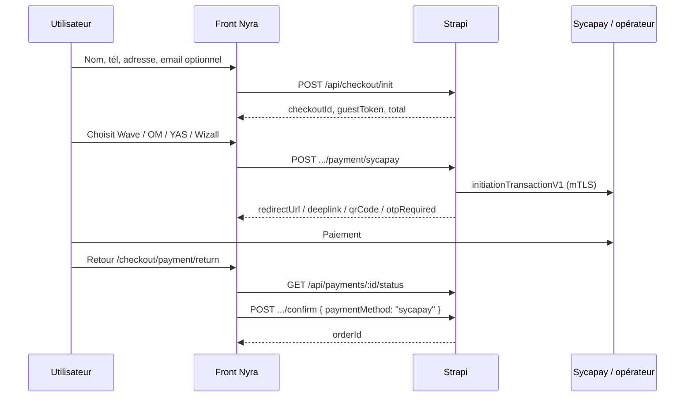

# Nyra — Front : paiement Sycapay

Document pour l’équipe **frontend**.  
Le front **ne parle jamais à Sycapay** : uniquement l’API Strapi Nyra.

**Formulaire client (avant ce doc) :** [`frontend-checkout-infos-client.md`](./frontend-checkout-infos-client.md)  
→ uniquement **nom complet**, **téléphone**, **adresse**, **email facultatif** (pas de code postal / ville / pays).

Spec backend : [`sycapay-api-backend.md`](./sycapay-api-backend.md).

**Backend prod :** `https://secretdenyra-backend-production.up.railway.app`  
**Front prod :** `https://secretdenyra-frontend.vercel.app`

> PayTech / Intech est **retiré**. Ne plus appeler `/payment/paytech`.

---

## 0. Avant Sycapay — formulaire obligatoire

Sur l’écran paiement / checkout, le front collecte d’abord :

| Champ | Obligatoire |
|-------|-------------|
| Nom complet | Oui |
| Téléphone | Oui |
| Adresse | Oui (un seul texte) |
| Email | Non |

Puis `POST /api/checkout/init` (détail dans la doc infos client).  
Ensuite seulement : choix opérateur + appel Sycapay ci-dessous.

Le téléphone du formulaire sert aussi de `numeroBeneficiaire` Sycapay (préremplir / renvoyer le même numéro).

---

## 1. Flux global



---

## 2. Headers

| Route | JWT | `X-Checkout-Token` |
|-------|-----|-------------------|
| `POST /api/checkout/init` | Optionnel | Non (renvoie `guestToken`) |
| `POST .../payment/sycapay` | Ou invité | **Oui** si invité |
| `POST .../payment/sycapay/confirm-otp` | Ou invité | **Oui** si invité |
| `GET /api/payments/:id/status` | Ou invité | **Oui** si invité |
| `POST .../confirm` | Ou invité | **Oui** si invité |

`sessionStorage` : `checkoutId`, `guestToken`, `paymentId`.

---

## 3. Lancer le paiement

`POST /api/checkout/:checkoutId/payment/sycapay`

```json
{
  "codeService": "SN_PM_WAVE",
  "numeroBeneficiaire": "771234567"
}
```

| Champ | Obligatoire | Notes |
|-------|-------------|--------|
| `codeService` | Oui | Voir opérateurs |
| `numeroBeneficiaire` | Oui* | *Même téléphone que le formulaire client ; si omis, le backend reprend `customer.phone` |

### Codes opérateur (Sénégal — paiement marchand)

| UI | `codeService` | Indicatif tél. |
|----|---------------|----------------|
| Wave | `SN_PM_WAVE` | +221 |
| Orange Money | `SN_PM_OM` | +221 |
| YAS | `SN_PM_YAS` | +221 |
| Wizall | `SN_PM_WIZALL` | +221 |

`numeroBeneficiaire` : **sans** indicatif pays — ex. `771234567` (pas `+221771234567`).

### Réponse `201`

```json
{
  "paymentId": "uuid",
  "idPartenaire": "NYRA-…",
  "tokenTX": "TX_…",
  "status": "PENDING",
  "codeService": "SN_PM_WAVE",
  "redirectUrl": "https://pay.wave.com/…",
  "deeplink": null,
  "qrCode": null,
  "otpRequired": false
}
```

### Comportement UI selon la réponse

| Cas | Action front |
|-----|----------------|
| `redirectUrl` présent (souvent Wave) | `window.location.href = redirectUrl` |
| `deeplink` / `qrCode` (souvent OM / YAS) | Afficher QR et/ou ouvrir le deeplink mobile |
| `otpRequired: true` (Wizall) | Écran saisie OTP → `confirm-otp` |

> **Important (doc Sycapay) :** un `errorCode: "201"` avec message « Paiement en cours… » n’est **pas** un échec si `urlRedirection` est présent. Le backend Nyra renvoie alors `redirectUrl` en **201** — le front **doit rediriger**, pas afficher une erreur.

---

## 4. OTP Wizall

`POST /api/checkout/:checkoutId/payment/sycapay/confirm-otp`

```json
{
  "paymentId": "uuid",
  "otp": "123456"
}
```

---

## 5. Page de retour

URLs configurées côté backend :

- succès : `/checkout/payment/return?result=success`
- échec : `/checkout/payment/return?result=cancel`

Sur la page retour :

1. Lire `checkoutId`, `paymentId`, `guestToken` depuis **sessionStorage** (pas l’URL Sycapay).
2. Poller `GET /api/payments/:paymentId/status` jusqu’à `SUCCESS` (ou timeout).
3. `POST /api/checkout/:checkoutId/confirm` :

```json
{
  "paymentMethod": "sycapay",
  "paymentId": "uuid"
}
```

4. Afficher la commande (`orderId`).

---

## 6. Statut paiement

`GET /api/payments/:paymentId/status`

```json
{
  "paymentId": "uuid",
  "status": "PENDING",
  "refCommand": "NYRA-…",
  "errorType": null
}
```

Statuts : `PENDING` | `SUCCESS` | `CANCELED` | `FAILED`.

---

## 7. Erreurs fréquentes

| HTTP | Code | Signification |
|------|------|----------------|
| 400 | `PAYMENT_INFO_INCOMPLETE` | `codeService` / téléphone invalide |
| 503 | `PAYMENT_INFO_INCOMPLETE` | Config Sycapay absente côté serveur |
| 503 | `PAYMENT_TIMEOUT` | Sycapay a refusé / indisponible (`details.sycapayMessage`) |
| 402 | `PAYMENT_DECLINED` | Paiement échoué / OTP refusé |
| 409 | `PAYMENT_INFO_INCOMPLETE` | Pas encore `SUCCESS` au `confirm` |

---

## 8. Exemple TypeScript (extrait)

```ts
export async function startSycapayPayment(
  checkoutId: string,
  guestToken: string | null,
  body: { codeService: string; numeroBeneficiaire: string },
) {
  const res = await fetch(`${API}/api/checkout/${checkoutId}/payment/sycapay`, {
    method: 'POST',
    headers: {
      'Content-Type': 'application/json',
      ...(guestToken ? { 'X-Checkout-Token': guestToken } : {}),
    },
    body: JSON.stringify(body),
  });
  if (!res.ok) throw await res.json();
  return res.json() as Promise<{
    paymentId: string;
    redirectUrl: string | null;
    deeplink: string | null;
    qrCode: string | null;
    otpRequired: boolean;
  }>;
}
```

---

## 9. Checklist front

- [ ] Formulaire client simplifié (nom, tél, adresse, email optionnel) — voir doc infos client
- [ ] Plus aucun appel PayTech
- [ ] Étape choix opérateur (Wave / OM / YAS / Wizall)
- [ ] `numeroBeneficiaire` = téléphone du formulaire
- [ ] Gérer `redirectUrl` **ou** deeplink/QR **ou** OTP
- [ ] Page `/checkout/payment/return` + poll status + `confirm`
- [ ] Aucune clé / certificat Sycapay dans le front
