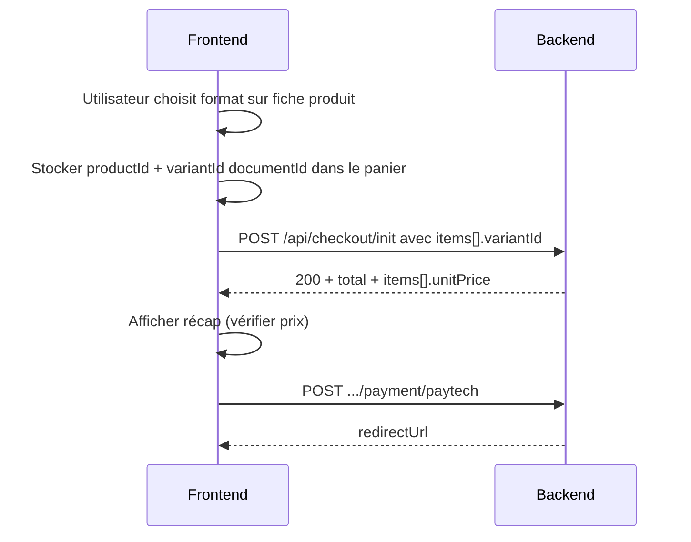

# Frontend — Checkout variantes & Secret de Nyra

**Audience :** équipe frontend (Vite / Vercel)  
**Backend :** `https://secretdenyra-backend-production.up.railway.app`  
**Date :** juin 2026  
**Complète :** [`frontend-checkout-api.md`](./frontend-checkout-api.md) (flux PayTech, CORS, invité, etc.)

---

## Résumé

| Sujet | Avant (bug) | Après correctif backend |
|-------|-------------|-------------------------|
| Secret de Nyra | `init` → 404 `PRODUCT_NOT_FOUND` | `init` → **200** (produits sans variante, prix = `product.price`) |
| Plusieurs formats (250g / 50g) | Toujours le prix du 1ᵉʳ format | Prix selon **`variantId`** envoyé |
| `variantId` ignoré | Montant PayTech incorrect | Obligatoire dès qu’il y a plusieurs variantes |

**Action front :** envoyer `variantId` sur chaque ligne du panier au `POST /api/checkout/init` et **retirer** le blocage paiement sur la catégorie `secret-de-nyra` (une fois le backend déployé).

---

## 1. Body `POST /api/checkout/init` — lignes panier

Chaque élément de `items` doit inclure :

```json
{
  "productId": "darjeeling-ftgfop1-chamong-bio-en-vrac",
  "variantId": "kt9xifoz7nw1xp16ejyqoabw",
  "quantity": 1
}
```

### `productId` (obligatoire)

Identifiant produit accepté par le backend :

| Type | Exemple |
|------|---------|
| `slug` | `"darjeeling-ftgfop1-chamong-bio-en-vrac"` |
| `documentId` Strapi | `"l3qls37jbu1tdojs3z1jba43"` |
| `id` numérique | `"42"` |

Utiliser les **mêmes identifiants qu’en prod** Strapi (pas seulement ceux du local).

### `variantId` (fortement recommandé)

| Cas | Comportement backend |
|-----|----------------------|
| Produit **avec** plusieurs variantes + `variantId` fourni | Prix de **cette** variante |
| Produit avec variantes, **sans** `variantId` | Variante **par défaut** (`isDefault` ou 1ʳᵉ position) |
| Produit **sans** variante (ex. Secret de Nyra) | **Ignorer** `variantId` — prix = `product.price` |
| `variantId` fourni mais **invalide** | **400** `VARIANT_NOT_FOUND` |

**Priorité côté front :** envoyer le **`documentId`** Strapi de la variante sélectionnée (stable entre environnements).

Alternatives acceptées : `id` numérique interne, `sku`.

### Exemple Secret de Nyra (sans variante)

```json
{
  "items": [
    {
      "productId": "product-4",
      "quantity": 1
    }
  ]
}
```

Pas besoin de `variantId` si le produit n’a pas de variantes en base.

### Exemple thé avec deux formats

```json
{
  "items": [
    {
      "productId": "darjeeling-ftgfop1-chamong-bio-en-vrac",
      "variantId": "DOCUMENT_ID_VARIANTE_50G",
      "quantity": 1
    }
  ]
}
```

Vérifier dans la réponse `init` que `items[0].unitPrice` correspond au format choisi (ex. **5000** pour 50g, **24800** pour 250g).

---

## 2. Réponse `init` — champs à contrôler

Après `POST /api/checkout/init` (200), vérifier :

```json
{
  "checkoutId": "chk_...",
  "guestToken": "gst_...",
  "subtotal": 5000,
  "shipping": 2500,
  "total": 7500,
  "currency": "XOF",
  "items": [
    {
      "quantity": 1,
      "unitPrice": 5000,
      "lineTotal": 5000,
      "product": { "id": "...", "slug": "...", "name": "..." },
      "variant": {
        "id": "...",
        "label": "50g",
        "format": "50g",
        "price": 5000
      }
    }
  ]
}
```

| Champ | Usage front |
|-------|-------------|
| `items[].unitPrice` / `lineTotal` | Afficher le récap commande **avant** PayTech |
| `items[].variant.label` ou `format` | Confirmer que le bon format est pris en compte |
| `total` | Doit correspondre à ce que l’utilisateur a vu sur la fiche produit (+ livraison) |

Si `unitPrice` ne correspond pas au format sélectionné → ne pas lancer le paiement ; revoir `variantId` envoyé.

---

## 3. Erreurs à gérer dans l’UI

| HTTP | `code` | Message utilisateur suggéré |
|------|--------|----------------------------|
| 404 | `PRODUCT_NOT_FOUND` | Ce produit n’est plus disponible. Retirez-le du panier. |
| 400 | `VARIANT_NOT_FOUND` | Le format choisi n’est plus disponible. Rechargez la page produit. |
| 409 | `OUT_OF_STOCK` | Stock insuffisant pour ce format. |
| 410 | `CHECKOUT_EXPIRED` | Session expirée. Recommencez la commande. |

### Ne plus confondre les 404

| `code` | Signification |
|--------|----------------|
| `PRODUCT_NOT_FOUND` | Produit introuvable ou **non publié** en prod |
| `VARIANT_NOT_FOUND` | Produit OK, **mauvais** `variantId` |
| `NOT_FOUND` (sans code métier) | URL API incorrecte |

L’ancien message générique *« Un produit du panier n’existe plus »* sur Secret de Nyra était souvent un **`PRODUCT_NOT_FOUND`** dû à l’absence de variante — ce cas est corrigé côté backend.

---

## 4. Secret de Nyra — retirer le blocage front

Si le front bloque encore le paiement pour `category.slug === "secret-de-nyra"` :

1. **Supprimer** ce blocage après déploiement backend.
2. Envoyer uniquement `productId` + `quantity` (pas de `variantId` requis).
3. Tester `product-4`, `product-1`, etc. → `init` doit retourner **200**.

Produits concernés (ex. prod) :

| slug | documentId | Variantes en base |
|------|------------|-------------------|
| `product-1` | `lxthm4wu4p6b8u3xcha8kc1y` | 0 |
| `product-3` | `ab1pht0swdub215ae83f9h8e` | 0 |
| `product-4` | `l3qls37jbu1tdojs3z1jba43` | 0 |

---

## 5. Flux panier → paiement (rappel)



**Règle :** le `variantId` du panier local doit être recopié **tel quel** dans le body `init`, pas seulement le `productId`.

---

## 6. Modèle TypeScript suggéré

```ts
type CartLine = {
  productId: string;       // slug ou documentId prod
  variantId?: string;      // documentId variante — requis si plusieurs formats
  quantity: number;
};

type CheckoutInitBody = {
  customer: { firstName: string; lastName: string; email: string; phone: string };
  shippingAddress: { line1: string; city: string; country: string; line2?: string; postalCode?: string };
  billingSameAsShipping: boolean;
  billingAddress?: Record<string, string>;
  items: CartLine[];
};
```

Helper pour construire une ligne depuis la fiche produit :

```ts
function toCheckoutLine(product: Product, selectedVariant: Variant | null, qty: number): CartLine {
  return {
    productId: product.documentId ?? product.slug,
    ...(selectedVariant
      ? { variantId: selectedVariant.documentId ?? String(selectedVariant.id) }
      : {}),
    quantity: qty,
  };
}
```

---

## 7. Checklist frontend

- [ ] Panier stocke `variantId` (documentId) à l’ajout depuis la fiche produit
- [ ] `POST /api/checkout/init` envoie `items[].variantId` pour les produits à variantes
- [ ] Récap commande affiche `items[].variant.label` et `unitPrice` avant PayTech
- [ ] Blocage `secret-de-nyra` retiré après déploiement backend
- [ ] Gestion UI de `VARIANT_NOT_FOUND` (400)
- [ ] Pas de changement sur PayTech / `X-Checkout-Token` (voir `frontend-checkout-api.md`)

---

## 8. Critères d’acceptation (tests manuels)

1. **Darjeeling 50g** : `init` → `subtotal` = **5000** XOF (+ livraison si &lt; 45 000).
2. **Darjeeling 250g** : `init` → `subtotal` = **24800** XOF.
3. **product-4** (Secret de Nyra) : `init` → **200**, pas de 404.
4. Changer de format sur la fiche produit → le **total** au checkout change.

---

## Références

| Document | Contenu |
|----------|---------|
| [`frontend-checkout-api.md`](./frontend-checkout-api.md) | PayTech, CORS, invité, confirm, retour paiement |
| [`docs/backend-checkout-corrections-complet.md`](./docs/backend-checkout-corrections-complet.md) | **Ticket backend complet** (variantes, Secret de Nyra, tests prod) |
| [`docs/backend-checkout-variantes-secret-de-nyra.md`](./docs/backend-checkout-variantes-secret-de-nyra.md) | Redirection vers le ticket complet |

*Backend déployé requis — commit `resolveCheckoutLineItem` sur Railway.*
